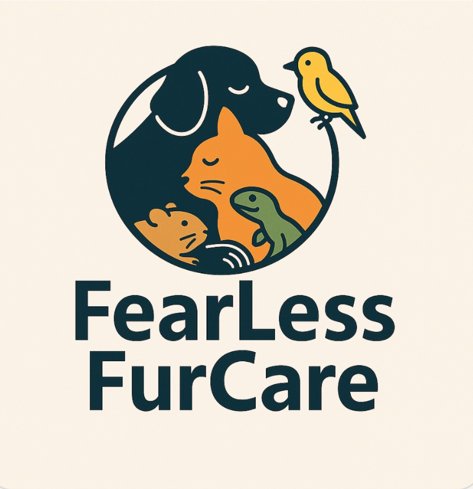

Applying eye drops or ointments can be challenging for many pet owners, especially when dealing with nervous or sensitive animals. To help make this process as stress-free as possible, I’ve asked **Vikki Foster RVN**—an experienced *Registered Veterinary Nurse* and founder of **FearLess Fur Care**—to share her expert, fear-free approach to administering eye medications.

## Administering Eye Drops to Your Pet: A Step-by-Step Fear Free Approach  
**By Vikki Foster RVN – FearLess Fur Care**  
*Supporting dogs, cats, rabbits, guinea pigs, and exotic pets with gentle, cooperative care.*

  

If you're interested in getting in touch with Vikki, you can do so by [following FearLess Fur Care on Facebook](https://www.facebook.com/FearLessFurCaregroup)

---

### 🧘 Step 1: Prepare the Environment  
- Choose a **quiet, familiar space** with soft lighting.  
- Use a towel, non-slip mat, or bedding with your pet’s scent.  
- Have **high-value treats** ready: chicken, Lick-e-Lix, liver paste, etc.  
- For small pets: herbs, veggies, or fruit!

---

### 🐾 Step 2: Position Your Pet Comfortably  
- **Dogs & Cats**: Sit beside them on the floor, sofa, or a table if appropriate.  
- **Rabbits & Guinea Pigs**: Let them sit in a hide or on your lap.  
- Use a towel wrap for gentle security if needed.  
- Avoid forceful restraint—**support, don’t pin**.  
- A helper is also useful for **treat dispensing** and gentle support.

---

### 💛 Step 3: Build Trust Through Touch  
- Gently stroke your pet’s head and speak in a **calm, reassuring voice**.  
- Practice lifting the chin and touching near the eyes **without administering drops**.  
- Reward each step with **treats or praise** to build positive associations.  
- Use a **clicker** (if pre-conditioned) or a **marker word** like “yes” or “good” before rewarding.

---

## 🎥 Watch the Process in Action  

Here’s a short video demonstration by **Vikki Foster RVN**, showing a calm and practical way to give your pet eye medication:  

<iframe width="560" height="315" 
src="https://www.youtube.com/embed/OyltZEZaAEs" 
title="How to give eye drops to pets - with Vikki Foster RVN" 
frameborder="0" 
allow="accelerometer; autoplay; clipboard-write; encrypted-media; gyroscope; picture-in-picture; web-share" 
allowfullscreen>
</iframe>

---

### 👁️ Step 4: Administer the Eye Drops  
- Hold the bottle in your **dominant hand**.  
- Use your other hand to **gently lift the upper eyelid**.  
- Place the drop **into the upper eyelid pocket**, not directly onto the eye.  
- Let the drop disperse naturally as your pet **blinks**.  
- For **ointments**, apply it into the **lower lid** and let your pet blink.  
- Administer the prescribed number of drops **quickly and smoothly**.

---

### 🎉 Step 5: Reward and Reassure  
- Immediately offer a **treat, toy**, or **verbal praise**.  
- Allow your pet to **relax or retreat** to a safe space.  
- Avoid wiping the eye unless specifically advised by your vet.

---

### 🔁 Step 6: Practice Cooperative Care  
- Use a consistent **cue** like “eye time” to signal the routine.  
- Repeat the handling steps even when not medicating to reinforce calm behaviour.  
- If your pet shows **fear or resistance**, **pause** and try again later—never push through distress.  
- Consider teaching a **chin rest**—a helpful behaviour for administering medications and performing health checks.

---

### ✅ Tips for Success  
- Keep sessions **short and positive**.  
- Use **species-appropriate treats** and handling techniques.  
- **Consult your vet** if you're struggling—there may be alternative methods or support available.

