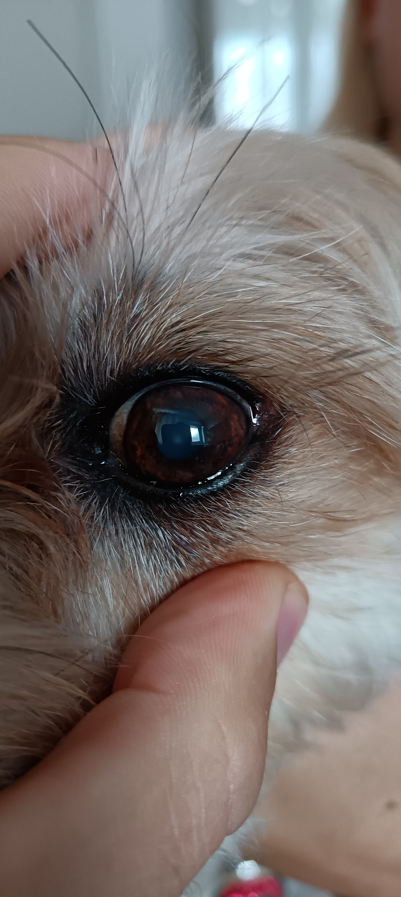
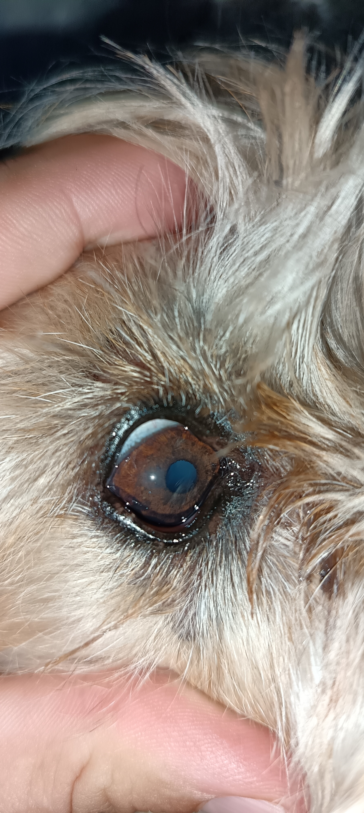
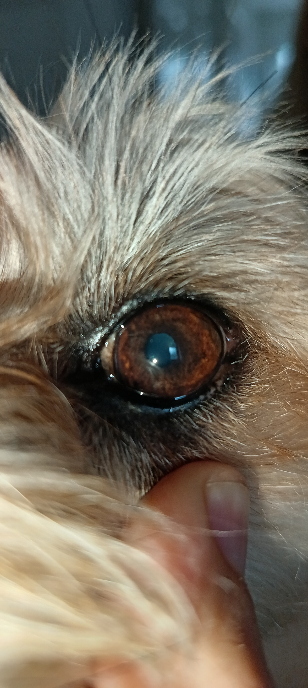
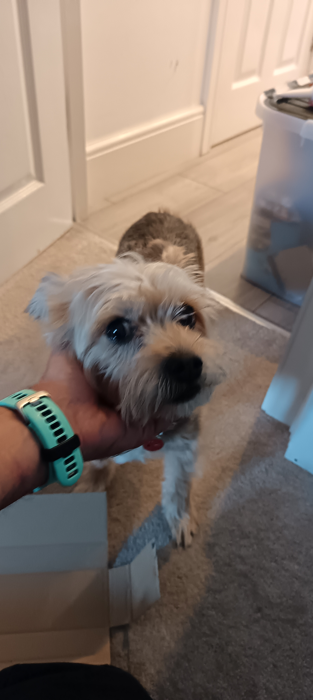
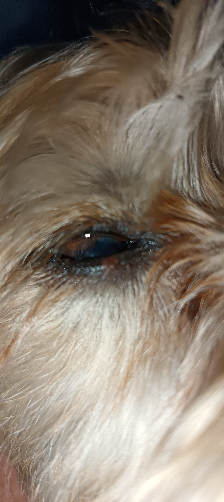
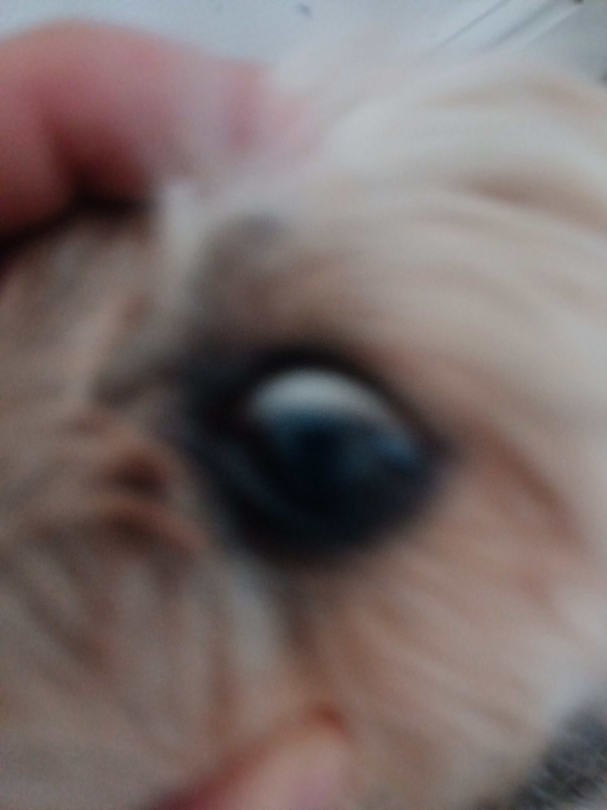
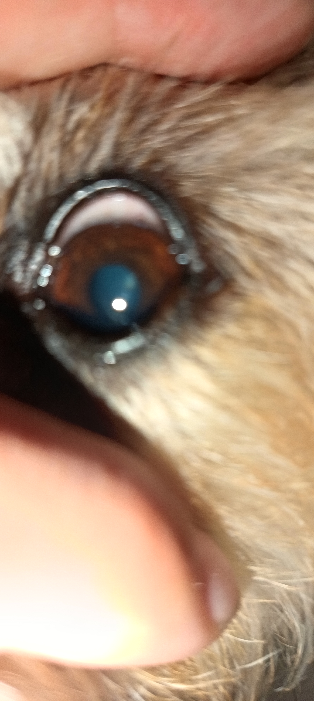
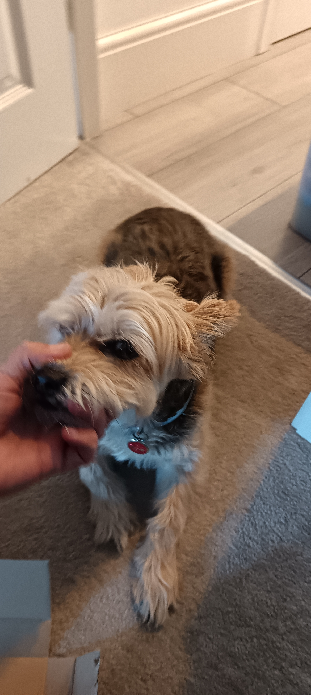

# 📸 How to Take a Good Photo for Your Vet  

Photos can be extremely helpful, particularly when:  
- Symptoms are intermittent  
- Your vet isn’t immediately available  
- You’re seeking a second opinion  

## 📷 Tips for Taking a High-Quality Photo  

1. **Lighting**  
   - **First, take a photo without flash** using natural light. (Your pet may not tolerate a second attempt if startled by the initial flash.)  
   - **Then, take a second photo** in a dimly lit room (not completely dark) with the flash enabled for better clarity.  

2. **Assistance**  
   - Have someone help hold your pet’s head steady while you take the photo—doing this alone can be challenging.  

3. **Focus**  
   - Tap your screen to focus on the eye.  
   - If there’s a reflection on the cornea, ensure it’s clearly visible.  

4. **Proximity**  
   - Avoid zooming in. Instead, get as close as possible so the eye fills most of the screen.  
   - Wide shots with excessive background or body parts are less useful—details become unclear when zoomed in.  

5. **Both Eyes**  
   - Photograph the other eye as well—sometimes both eyes are affected, even if only one shows obvious symptoms.  

6. **Additional Details**  
   - If relevant, include the third eyelid or eyelid edge for a more thorough assessment.

7. **Don't worry if you can't**
   - Mobile phones are not designed for medical photos. If despite a few attempts, you can't get a good quality photo, do not worry.
   - It might be better to allow your pet to rest and invest your time in organising your vet visit.

# Example of acceptable photos ✔️

|  |
| Without Flash |
|  | 
| With Flash | 
|  |
| With Flash |

# Examples of low quality photos ❌

|  |  | 
| Moving/Too much background | Eye almost closed/blinking | 
|  |  | 
| Blurred | Blurred | 
|  |
| Too much background/dark eye |  
